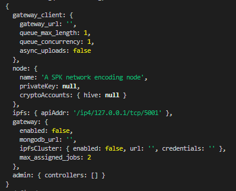

# Video Encoder Client Setup

### Prerequisites 
- Linux server capable of encoding videos in a timely manner. (good internet, processor)
- Basic understand of CLI commands


#### Native Method

Install NodeJS/PM2:

```
sudo apt update
sudo apt upgrade -y
curl -fsSL https://deb.nodesource.com/setup_16.x | sudo -E bash -
sudo apt install nodejs -y
sudo apt install npm -y
hash -r
sudo npm install -g npm
npm i -g pm2
```

Install ffmpeg

```
sudo apt install ffmpeg
```

Install Kubo(IPFS)

```
wget https://dist.ipfs.tech/kubo/v0.18.1/kubo_v0.18.1_linux-amd64.tar.gz
tar -xf kubo_v0.18.1_linux-amd64.tar.gz
cd kubo
chmod +x install.sh
./install.sh
```

Run IPFS

```
ipfs init --profile server
pm2 start "ipfs daemon" --name ipfs
```
 
 Clone the project:
 
 ```
 git clone https://github.com/spknetwork/video-encoder.git
 ```
 
 Setup the project
 
 ```
 cd video-encoder
 npm install --force
 npm run build
 pm2 start "npm run start" --name videoEncoder
 ```
 
 Configure your hive account
 
 ```
 cd
 cd .spk-encoder
 nano config
 ```
 
 Within `node.name` input the name of the node. Within cryptoAccounts.hive, put in your hive username as a string, example "null". Save and exist with `Control + O, Control + X`
 
 Restart the encoder software
 
 ```
 pm2 reload videoEncoder
 ```
 
 Enable auto startup on boot:
 
 ```
 pm2 startup
 ```
 At this point you might be given a command to copy/paste and run. Do that.
 
 Finish enabling auto startup on boot:
 
 ```
 pm2 save
 ```
 

#### Docker Method

Step 1:

```
apt install git docker-compose
```

Step 2:

```
git clone https://github.com/spknetwork/video-encoder.git
cd video-encoder
```

Step 3:
This step might take awhile

```
docker-compose up
```

Once it's running it must be stopped with ctrl-c so we can configure it further.

Now, there will be a folder inside the directory labeled `data`. 
Inside that directory there will be two more files. The first being IPFS (ignore it) and the other will be labeled `video-encoder`. 
Inside the video-encoder folder there will be a file called `config` (open this with your editor of choice)



Pay attention to the section inside `node { }` and `gateway_client { }`. Everything else can be left the same.

First off change gateway_url to `https://encoder-gateway.infra.3speak.tv` with quotes around it.

Next up modify the cryptoAccounts section and set hive to your HIVE username. If you wish to receive rewards.

Please note, the privateKey inside the node section is NOT your HIVE private key. It is autogenerated by the node upon start and is used to uniquely identify your node.

Finally, change the `name` variable in the `node` section to something nice and easily identifiable. 

From here, you can start the encoder and start processing jobs as they become available.

You will want to test your changes first

```
docker-compose up 
```

Then once verified the node is running background the process by restarting the app with

```
docker-compose up -d
```